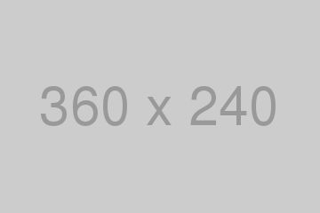

# Weather App

This is a simple weather app created using HTML, CSS and JavaScript.

In this mini-app i used:
- **CSS**: `flexbox` to create a responsive, centered card.
- **API**: [OpenWeatherMap](https://openweathermap.org/) API to get the current weather for any city.
- **JavaScript**: 
	- `fetch()` to access APIs.
	- to dynamically modify content on the page & background images.
- **Unsplash**: to get a random background image `https://source.unsplash.com/1600x900/?landscape` ([Unsplash](https://unsplash.com/)).
