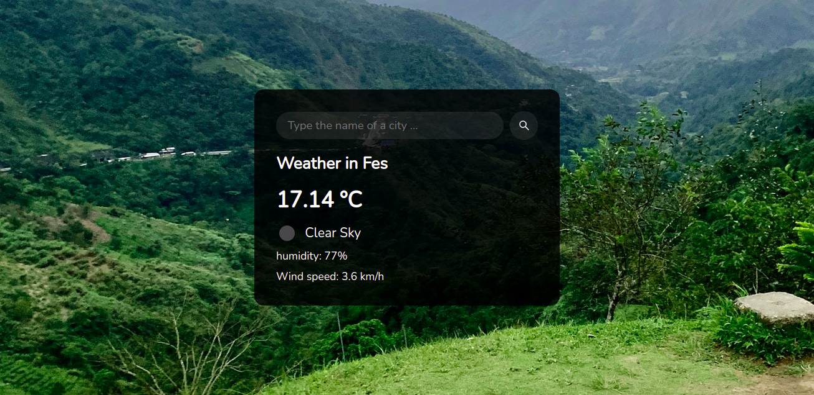

# Weather App

This is a simple weather app created using HTML, CSS and JavaScript.

### In this mini-app i used:
- **CSS**: `flexbox` to create a responsive, centered card.
- **API**: [OpenWeatherMap](https://openweathermap.org/) API to get the current weather for any city.
- **JavaScript**: 
	- `fetch()` to access API.
	- to dynamically modify content on the page & background images.
- **Unsplash**: to get a random background image `https://source.unsplash.com/1600x900/?landscape` ([Unsplash](https://unsplash.com/)).

### Try the app:
You can try this app by visiting the following link:
[https://mehdi-belhaj.github.io/weather-app/src/](https://mehdi-belhaj.github.io/weather-app/src/)

### New feature Comming:
- [ ] Cities name autocomplete.
- [ ] Initial Location (city of the current user).
- [ ] Current time (based on user time zone).
- [ ] Change unit (F/C).
- [ ] Translation (Fr & Ar).
